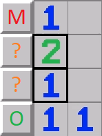

# minesweeper-solver

This project aims to create a minesweeper solving algorithm for the no guessing variation of minesweeper that is as efficient as possible.

For a quick demo, there are YouTube videos here:
  * [All Boards](https://youtu.be/cC36c1iUSS8)
  * [Single Board, slowly with label for which sub-algorithm it is using](https://youtu.be/Dfj6bvHwmMU)

The boards I used for test cases came from minesweeper.online. Their boards for this variant are the hardest I have found.

I chose to focus on the no-guessing variation as it is the version of the game I usually play and it would be easier to test knowing that all of the boards are solvable.

Here is a high-level overview of the algorithm:
  * The algorithm has 4 sub-algorithms which are successively more powerful, yet computationally expensive.
  * The first of these is the single square algorithm, which looks at a single revealed number square at a time.
      + If the number of remaining mines next to the square is equal to the number of unknown squares, it will mark them as mines:
      + 
      + If the square already has the maximum number of mines, it will open all other squares:
      + 
  * Algorithm 2 is the set overlap algorithm.
      + This algorithm will compare two nearby revealed number squares.
      + 
      + In this first example, there are three unknown squares next to the 2. But since there is a 1 beneath it, only one of the squares marked with a question mark can be a mine, meaning that the top square must be a mine.
      + Similarly, if one of the question mark squares is a mine, then the bottom square must not be a mine or else the 1 would have too many adjacent mines.
      + 
      + This situation is identical once the already-marked mines are accounted for.
  * Algorithm 3 is the constraint propogation algorithm.
      + This algorithm will find constraints on unknown squares and then use those constraints to find other constraints until it can open/flag a square. Here is an example:
      + 
      + Due to the 3 on the left side, we know that exactly one of the squares marked "A" contains a mine.
      + Using this knowledge, we can then see that the 4 has one remaining mine when accounting for the "A" squares, and it has to be in one of the squares marked "B".
      + Using the "B" squares, we can see that the marked 2 square to the right of the 4 has both mines accounted for: one already marked, and one of the squares marked "B". This means that we can open its last square, marked with a green O.
  * The final algorithm is a recursive backtracking algorithm.
      + This is a commonly used algorithm to try all of the options in an efficient manner.
      + It will generate valid combinations of mines, taking into account how many mines are left in total.
      + If it can't generate a valid combination of mines for a particular square, then there must not be a mine there.
      + 
      + This is a simple example where there is only one mine left, so there is only one possible place to put it and all of the other squares must be safe.
      + 
      + This is a bit more complex example where there are 5 mines left. Each of the letter pairs contain exactly one mine, meaning that the three squares marked with the green Os are safe to open.

Overview of folder structure:
  * The Minesweeper folder contains the Unity project, which has a recreation of Minesweeper in Unity as well as the actual algorithm.
      + All code is located in Minesweeper/Assets/Scripts
      + The algorithm is in Sweepotron_AI.cs
  * minesweeper-image-parser contains a quick python script that I used to translate screenshots of boards from minesweeper.online to a format that could be loaded into the Unity project for testing purposes.
      + This was quick and dirty, so there are some hardcoded values for parsing the image.
      + Depends on two libraries: matplotlib and skimage
